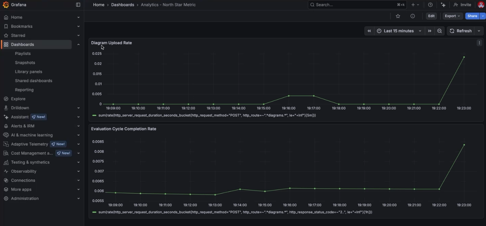

# Analytics Plan

**Perspective**: Business and users  
**Focus**: Value, engagement, and growth

## Brainstorm: Goals and Questions

### Top 3-5 Business or User Goals

1. **Enable systematic architecture evaluation**: Users successfully evaluate
   architectures using matrix-based approach following ADD methodology.

2. **Improve architecture decision-making efficiency**: Users complete core
   workflow (upload → matrix → score → compare) faster than manual methods.

3. **Support learning and adoption**: Students and researchers learn and apply architecture evaluation methodologies effectively.

4. **Enable architecture evolution tracking**: Users track and understand architecture evolution through version comparison.

5. **Provide actionable insights**: Users receive clear feedback that helps improve architectural designs.

### Questions to Answer for Each Goal

#### Goal 1: Enable systematic architecture evaluation

- Q1.1: How many users successfully complete a full evaluation cycle
  (upload → matrix → score → save)?
- Q1.2: What percentage of uploaded PlantUML diagrams are successfully
  parsed and converted to matrices?
- Q1.3: How many NFR-component relationships do users typically evaluate
  per session?
- Q1.4: Do users return to evaluate multiple architecture versions over
  time?
- Q1.5: What is the average time from diagram upload to completed
  evaluation matrix?

#### Goal 2: Improve architecture decision-making efficiency

- Q2.1: How long does it take users to complete the core workflow
  (upload → matrix → score → compare)?
- Q2.2: How many interactions (clicks, edits) are required to complete
  an evaluation?
- Q2.3: What percentage of users complete evaluations without errors or
  needing to restart?
- Q2.4: How often do users use version comparison features?
- Q2.5: What is the time difference between first-time and returning
  users?

#### Goal 3: Support learning and adoption

- Q3.1: How many unique users actively use the tool over time?
- Q3.2: What is the user retention rate (users who return after first
  use)?
- Q3.3: How many evaluation sessions do users typically complete?
- Q3.4: Do users explore advanced features (version comparison, diff
  visualization)?
- Q3.5: What is the learning curve (time to first successful
  evaluation)?

#### Goal 4: Enable architecture evolution tracking

- Q4.1: How many users create and compare multiple versions of their
  architectures?
- Q4.2: What is the average number of versions per architecture?
- Q4.3: How often do users use diff visualization features?
- Q4.4: Do users track quality improvements/regressions over time?
- Q4.5: What is the time span between version comparisons?

#### Goal 5: Provide actionable insights

- Q5.1: Do users modify their architectures based on evaluation results?
- Q5.2: What percentage of evaluations result in score changes over
  time?
- Q5.3: How do users interact with evaluation reports?
- Q5.4: What features do users find most valuable (matrix, diff,
  scoring)?
- Q5.5: Do users export or share evaluation results?

---

## Define Hypotheses

### 3 Highest-Priority Questions

1. **Q1.1**: How many users successfully complete a full evaluation cycle?
   - **Priority**: Critical - Directly measures core value proposition

2. **Q2.1**: How long does it take users to complete the core workflow?
   - **Priority**: Critical - Relates to efficiency goal and threshold of
     success (2 minutes for matrix)

3. **Q3.2**: What is the user retention rate?
   - **Priority**: High - Indicates whether tool provides ongoing value

### Formulated Hypotheses

#### Hypothesis 1: Evaluation Cycle Completion (North Star)

**We believe that** the automated matrix population feature **for**
software architects, students, and researchers **will result in** at least
70% of users successfully completing a full evaluation cycle (upload
PlantUML → auto-populated matrix → score adjustments → save version)
**when** they upload a valid PlantUML component diagram **because**
automation reduces manual effort and eliminates need to manually map
components to NFRs, making evaluation process accessible and efficient.

**Primary Indicator of Value (North Star)**: This is our North Star
metric because it directly measures core value proposition, captures
end-to-end user success, validates that tool solves the real problem, and
combines technical capability, usability, and value delivery.

#### Hypothesis 2: Workflow Efficiency

**We believe that** the integrated evaluation workflow (upload →
auto-populate → score → compare) **for** architecture practitioners
**will result in** users completing the core workflow in under 5 minutes
(including version comparison) **when** they have a valid PlantUML
diagram ready **because** automation eliminates manual matrix population,
reduces cognitive load, and provides immediate visual feedback.

#### Hypothesis 3: User Retention

**We believe that** the version comparison and evolution tracking features
**for** students and researchers working on architecture projects **will
result in** at least 40% of first-time users returning within 7 days to
create or compare additional architecture versions **because** architecture
evaluation is iterative, and ability to track evolution provides ongoing
value.

---

## Plan Measurements

### Hypothesis 1: Evaluation Cycle Completion (North Star)

#### Specific Data to Collect

- **User Actions**: `diagram_uploaded`, `parsing_succeeded`, `matrix_populated`, `score_modified`, `version_saved`, `evaluation_completed`
- **User Context**: `user_id`, `session_id`, `diagram_complexity`, `nfr_count`
- **Success Metrics**: `completion_rate`, `dropoff_stage`, `time_to_completion`

#### How Much Data Needed

- **Minimum**: 30 completed evaluation cycles
- **Target**: 100+ completed evaluation cycles
- **Timeframe**: 4-6 weeks of active usage

#### Data Collection and Processing

- **Collection**: Instrument frontend and backend to track user actions and
  API calls using OpenTelemetry spans and events
- **Processing**: Aggregate events by session_id, calculate completion
  rates, identify dropoff points, compute time-to-completion metrics

### Hypothesis 2: Workflow Efficiency

#### Specific Data to Collect

- **Timing Data**: Timestamps for upload, parsing, matrix display, score edits, version save, comparison
- **Efficiency Metrics**: `total_workflow_time`, `parsing_time`, `matrix_population_time`, `scoring_time`, `comparison_time`
- **User Context**: `is_first_time_user`, `diagram_size`, `component_count`

#### How Much Data Needed

- **Minimum**: 50 workflow completions
- **Target**: 100+ workflow completions
- **Timeframe**: 4-6 weeks

#### Data Collection and Processing

- **Collection**: Use OpenTelemetry spans to measure operation durations,
  track frontend performance, instrument API endpoints
- **Processing**: Calculate workflow stage durations, aggregate by user
  type, compute percentiles, compare against target thresholds

### Hypothesis 3: User Retention

#### Specific Data to Collect

- **User Activity**: `first_session_date`, `last_session_date`, `session_count`, `days_between_sessions`, `total_evaluations`
- **Engagement Metrics**: `returning_user_flag`, `retention_day_7`, `retention_day_30`, `feature_usage`
- **User Context**: `user_type`, `evaluation_frequency`

#### How Much Data Needed

- **Minimum**: 50 unique users with 7+ days observation window
- **Target**: 100+ unique users
- **Timeframe**: 8+ weeks to measure 7-day and 30-day retention

#### Data Collection and Processing

- **Collection**: Track user sessions with persistent identifiers, record
  session times, track feature usage
- **Processing**: Calculate retention cohorts, compute 7-day and 30-day
  retention rates, analyze returning user behavior patterns

---

## Plan Instrumentation

### Architecture Overview

```text
Frontend (Flutter) → Backend (FastAPI) → OpenTelemetry SDK → Grafana Cloud (OTLP)
```

### Frontend Instrumentation

- Track user actions: diagram upload, matrix population, score modifications, version save, workflow completion
- Track performance: page load times, interaction times
- Use OpenTelemetry Dart SDK to send events as spans/events to Grafana Cloud

### Backend Instrumentation

- Configure OpenTelemetry with OTLP exporter for Grafana Cloud
- Auto-instrument FastAPI endpoints
- Track business events: diagram upload, parsing, matrix operations, version save
- Track performance: API response times, operation durations
- Use spans to capture workflow stages and metrics to track counts/durations

### Data Flow

1. Frontend tracks user interactions and sends events
2. Backend instruments API endpoints with OpenTelemetry
3. OpenTelemetry SDK collects traces, metrics, logs and exports to Grafana Cloud via OTLP
4. Grafana Cloud stores data (Tempo for traces, Prometheus for metrics, Loki for logs)
5. Grafana dashboards visualize metrics and calculate North Star metric

### Configuration

- Environment variables: `GRAFANA_CLOUD_OTLP_ENDPOINT`, `GRAFANA_CLOUD_API_KEY`, `OTEL_SERVICE_NAME`, `OTEL_SERVICE_VERSION`
- Grafana Cloud setup: Create account, generate API key, configure OTLP endpoint, set up dashboards

### Privacy Considerations

- MVP: Use session-based anonymous identifiers (no PII)
- Future: Add user consent for analytics (GDPR compliance)
- Data retention: 30 days minimum, 90 days recommended
- Anonymization: No personal information, only behavioral data

---

## Visualization and Dashboards

### Analytics Dashboards

All analytics dashboards are available in Grafana Cloud. Access them at:
[Grafana Cloud Dashboards](https://ilyapechersky.grafana.net/dashboards)

#### North Star Metric Dashboard

**Purpose:** Track evaluation cycle completion rate (primary success metric)

**Link:** [Analytics - North Star Metric Dashboard](https://ilyapechersky.grafana.net/d/Analytics-North-Star-Metric/analytics-north-star-metric)

**Key Panels:**

1. **Evaluation Cycle Completion Rate**
   - Metric: `evaluation_completed_total / diagram_uploaded_total * 100`
   - Target: ≥ 70%
   - Visualization: Time series graph with target line

2. **Workflow Funnel**
   - Stages: Upload → Parse → Matrix → Score → Save
   - Metric: Drop-off rate at each stage
   - Visualization: Funnel chart

3. **Completion Rate Over Time**
   - Metric: Rolling 7-day completion rate
   - Visualization: Line chart with trend

**Screenshot:**



### Metrics Available

The following metrics are collected and available in Grafana Cloud:

- `diagram_uploaded_total` - Total diagrams uploaded
- `parsing_succeeded_total` - Successful parsing operations
- `parsing_failed_total` - Failed parsing operations
- `evaluation_completed_total` - Completed evaluation cycles
- `version_saved_total` - Saved versions
- `diff_comparison_total` - Diagram diff comparisons
- `plantuml_parsing_duration_seconds` - Parsing duration histogram

### Creating Dashboards

To create these dashboards in Grafana Cloud:

1. Navigate to **Dashboards** → **New Dashboard**
2. Add panels using Prometheus queries for the metrics above
3. Use Grafana's query builder or PromQL:
   - `rate(diagram_uploaded_total[5m])` - Upload rate
   - `rate(evaluation_completed_total[5m])` - Completion rate
   - `histogram_quantile(0.95, rate(plantuml_parsing_duration_seconds_bucket[5m]))` - p95 parsing latency
4. Configure alerts based on North Star metric thresholds
