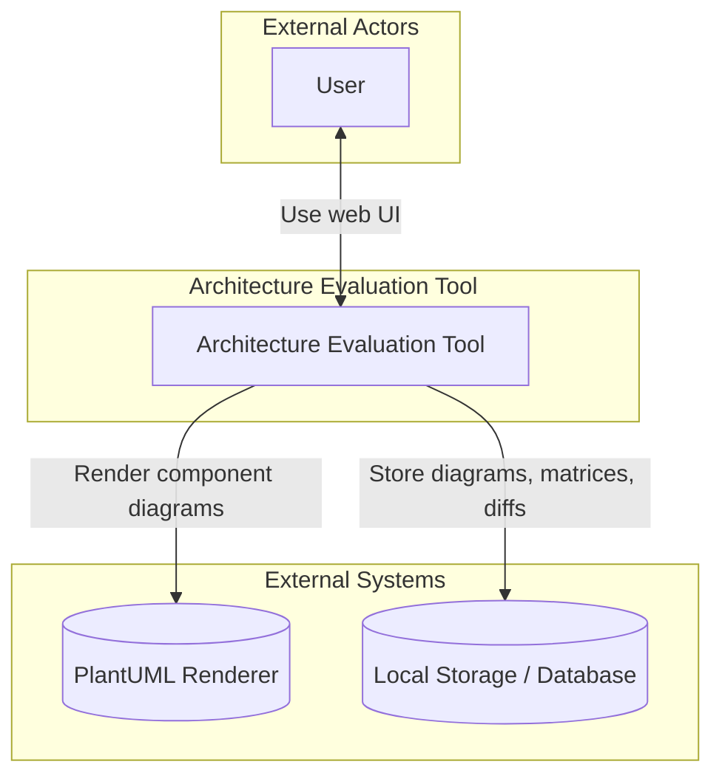
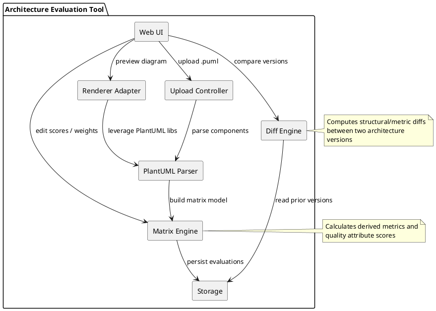
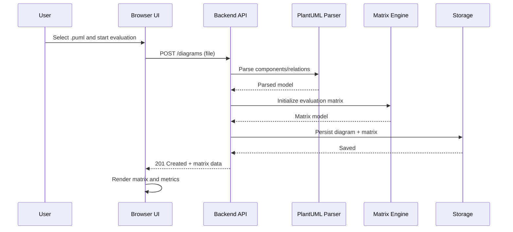
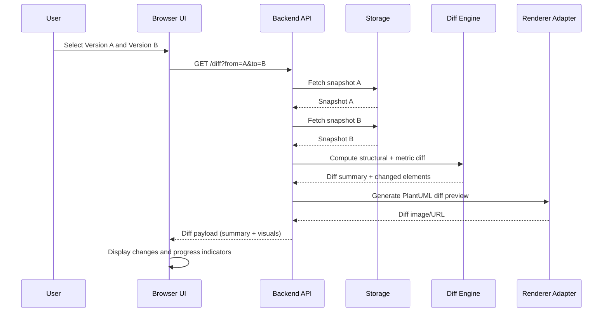
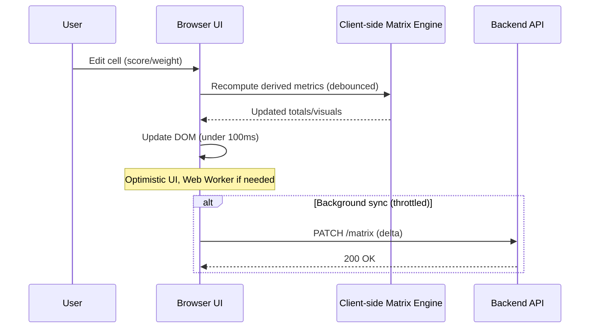

# Architecture Document

## Table of Contents
1. [Interactive prototype](#interactive-prototype)
2. [Context diagram (example)](#context-diagram-example)
   - [External actors](#external-actors)
3. [Use case diagram (example)](#use-case-diagram-example)
   - [Actors](#actors)
4. [Component diagram (example, code)](#component-diagram-example-code)
   - [Component responsibilities](#component-responsibilities)
5. [Sequence diagrams](#sequence-diagrams)
   - [User story: Upload PlantUML and evaluate](#user-story-upload-plantuml-and-evaluate)
   - [User story: Compare versions (Diff)](#user-story-compare-versions-diff)
   - [Quality requirement: Responsive Matrix Interaction (QAS201)](#quality-requirement-responsive-matrix-interaction-qas201)

## Interactive prototype

Link to the interactive prototype in Figma: [Figma link](https://www.figma.com/design/i01zuUDM9WZHPfULnAmpyI/Scheme?node-id=0-1&p=f)

## Context diagram (example)

Source: `docs/architecture/assets/context.mmd`

### External actors

- **User**: evaluates architectures against quality attributes, prepares reports.

## Use case diagram (example)

Source: `docs/architecture/assets/use-cases.mmd`

### Actors

- **User**: uploads diagrams, evaluates, and prepares evaluation reports.

## Component diagram (example, code)

Source: `docs/architecture/assets/components.puml`

### Component responsibilities

- **Web UI**: matrix visualization, editing scores/weights, diff view.
- **Upload Controller**: intake diagrams, validation, metadata extraction.
- **PlantUML Parser**: parse components/relations from PlantUML.
- **Matrix Engine**: build and compute matrix metrics and quality attribute scores.
- **Diff Engine**: compare two versions to produce structural and metric diffs.
- **Renderer Adapter**: integrate PlantUML rendering for previews.
- **Storage**: persist diagrams, matrices, and evaluation results.

## Sequence diagrams

### User story: Upload PlantUML and evaluate

Source: `docs/architecture/assets/seq-user-story.mmd`

### User story: Compare versions (Diff)

Source: `docs/architecture/assets/seq-diff.mmd`

### Quality requirement: Responsive Matrix Interaction (QAS201)

Derived from `docs/requirements/quality-requirements.md#performance` (QAS201: input-to-visual-update under 100ms).

Source: `docs/architecture/assets/seq-qas.mmd`

## Design decisions

This section documents the five most important architectural decisions made during the design phase, including the rationale, alternatives considered, and trade-offs.

### 1. Hexagonal Architecture (Ports and Adapters Pattern)

**Decision**: Adopt hexagonal architecture with clear separation between domain, application, and infrastructure layers.

**Rationale**:
- **Domain Independence**: The core business logic (diagram parsing, evaluation matrix, scoring) is isolated from technical concerns (storage, HTTP, parsing libraries)
- **Testability**: Domain entities and services can be tested without infrastructure dependencies using in-memory implementations
- **Flexibility**: Infrastructure can be swapped (e.g., file system → database, regex parser → library-based parser) without changing domain logic
- **Educational Value**: Clear separation helps students understand clean architecture principles

**Alternatives Considered**:
- **Layered Architecture**: Simpler but creates tight coupling between layers, making testing and swapping implementations difficult
- **MVC Pattern**: Too simplistic for backend logic; doesn't address persistence and external service concerns

**Trade-offs**:
- **Pros**: High maintainability, testability, and flexibility for future changes
- **Cons**: More initial complexity, requires discipline to maintain boundaries, additional abstraction layers

**Implementation**: 
- Domain layer (`app/domain/`) contains entities, repositories (interfaces), and parsers (interfaces)
- Application layer (`app/application/`) contains use cases and orchestration
- Infrastructure layer (`app/infrastructure/`) provides concrete implementations (in-memory storage, regex parser)
- Presentation layer (`app/presentation/`) handles HTTP API concerns

**Impact**: This decision enables the team to develop and test core functionality independently of storage and parsing implementations, supporting iterative development and early validation.

---

### 2. Client-Side Matrix Computation for Performance

**Decision**: Perform matrix calculations and updates on the client-side (Flutter Web) with optimistic UI updates and background synchronization to the backend.

**Rationale**:
- **Performance Requirement**: QAS201 requires input-to-visual-update latency under 100ms, which is difficult to achieve with server round-trips
- **User Experience**: Immediate feedback during matrix editing creates a responsive, interactive experience
- **Scalability**: Reduces server load by offloading computation to clients
- **Offline Capability**: Enables future offline editing features

**Alternatives Considered**:
- **Server-Side Computation**: Simpler data flow but introduces network latency (typically 50-200ms), making 100ms target unachievable
- **Hybrid Approach**: Complex state synchronization between client and server, prone to inconsistencies

**Trade-offs**:
- **Pros**: Meets performance requirements, better user experience, reduced server load
- **Cons**: Business logic duplication (client and server), potential for calculation inconsistencies, larger client bundle size

**Implementation**:
- Matrix calculation engine implemented in Dart/Flutter
- Optimistic UI updates with debouncing
- Background API calls (PATCH /matrix) to persist changes
- Server validates and stores final state

**Impact**: This decision directly addresses the performance quality requirement (QAS201) and enables the responsive matrix interaction that is critical for user satisfaction.

---

### 3. Docker-Based Deployment Strategy

**Decision**: Package the entire application (frontend, backend, nginx) using Docker Compose for single-command deployment.

**Rationale**:
- **Customer Requirement**: Customer explicitly requested Docker deployment for easy testing and demos (Sprint 1 meeting feedback)
- **Educational Context**: Students and researchers need simple deployment without DevOps expertise
- **Environment Consistency**: Ensures identical behavior across development, testing, and production
- **Isolation**: Prevents conflicts with system dependencies and simplifies dependency management

**Alternatives Considered**:
- **Native Installation**: Requires manual setup of Python, Flutter, dependencies - too complex for target users
- **Cloud Platform Deployment**: Adds cost and complexity; not suitable for local/educational use
- **Virtual Machines**: Heavier resource usage and slower startup compared to containers

**Trade-offs**:
- **Pros**: Simple deployment (`docker-compose up`), reproducible environments, easy for non-technical users
- **Cons**: Requires Docker installation, container management overhead, potential resource usage

**Implementation**:
- Separate Dockerfiles for backend (Python/FastAPI) and frontend (Flutter Web compiled to static assets)
- Docker Compose orchestrates services with nginx as reverse proxy
- Volume mounts for local storage persistence
- Environment variables for configuration

**Impact**: This decision enables frequent customer demos and early feedback cycles, which were emphasized as critical for project success. It also supports the educational use case where students need quick, reliable deployment.

---

### 4. PlantUML as Primary Input Format with Regex-Based Parser

**Decision**: Use PlantUML component diagrams as the standard input format and implement a regex-based parser for component and relationship extraction.

**Rationale**:
- **Customer Standard**: PlantUML is the chosen format by the customer for architecture specifications
- **Text-Based Format**: Enables version control integration, easy editing, and diff-friendly workflows
- **Simplicity**: Regex parser provides immediate implementation without external library dependencies
- **Extensibility**: Parser can be enhanced incrementally to support more PlantUML syntax patterns

**Alternatives Considered**:
- **PlantUML Java Library**: More comprehensive but requires Java runtime, adds complexity, and may be overkill for MVP
- **Structurizr DSL**: Alternative format but customer specifically requested PlantUML
- **GraphML/XML Formats**: Less human-readable, not aligned with customer requirements

**Trade-offs**:
- **Pros**: No external dependencies, fast implementation, full control over parsing logic
- **Cons**: Limited syntax coverage initially, requires manual maintenance for new PlantUML features, potential parsing edge cases

**Implementation**:
- `RegexPlantUMLParser` in `app/infrastructure/parsing/plantuml_parser.py`
- Supports component declarations, databases, queues, and relationships
- Extracts components and relationships into domain entities
- Error handling with `ParseError` exceptions

**Impact**: This decision establishes the foundation for all functionality. The parser's accuracy (QAS302) directly affects the quality of the evaluation matrix. The regex approach allows rapid MVP delivery while maintaining the option to migrate to a library-based parser if needed.

---

### 5. Separation of Parsing, Storage, and Evaluation Concerns

**Decision**: Implement parsing, storage, and evaluation as independent, composable services with clear interfaces.

**Rationale**:
- **Single Responsibility**: Each service has a focused purpose, making the system easier to understand and modify
- **Incremental Development**: Services can be developed and tested independently (e.g., parsing before evaluation, storage before diff)
- **Flexibility**: Evaluation logic can evolve independently of parsing (e.g., support different scoring algorithms)
- **Testability**: Each service can be tested in isolation with mock dependencies

**Alternatives Considered**:
- **Monolithic Service**: Single service handling all concerns - simpler initially but becomes hard to maintain and test
- **Tight Coupling**: Direct dependencies between components - faster to write but creates maintenance burden

**Trade-offs**:
- **Pros**: Clear boundaries, independent development, easier testing and maintenance
- **Cons**: More interfaces and dependency injection, slightly more code, requires architectural discipline

**Implementation**:
- `DiagramService`: Orchestrates diagram upload, parsing, and persistence
- `PlantUMLParser`: Abstract interface for parsing (implemented by `RegexPlantUMLParser`)
- `DiagramRepository`: Abstract interface for persistence (implemented by in-memory storage)
- `DiagramStorage`: Abstract interface for file storage (implemented by local file system)
- Future: `MatrixEngine` and `DiffEngine` as separate services

**Impact**: This decision enables the team to deliver functionality incrementally (parsing in Sprint 2, matrix in Sprint 3, diff in Sprint 5) while maintaining clean architecture. It also supports the contingency plan of swapping parsers if PlantUML parsing proves unreliable.

---

**Notes on Design Decisions**:
- These decisions were validated with the customer during Sprint 1 meeting
- Decisions prioritize MVP delivery speed while maintaining architectural quality
- Future iterations may refine these decisions based on user feedback and technical learnings
- All decisions align with the project's educational context and deployment constraints

---

Notes:
- Diagram source code is stored under `docs/architecture/assets/`. Generate images into the same folder or subfolders as needed.
- Update the Figma link when the interactive prototype is available.

Progress tracking:
- Store versioned snapshots of diagrams, matrices, and computed metrics in `Storage` with timestamps.
- `Diff Engine` computes deltas between snapshots to visualize structural changes and quality score trends.
- UI aggregates diffs over time to show progress across iterations/sprints.

