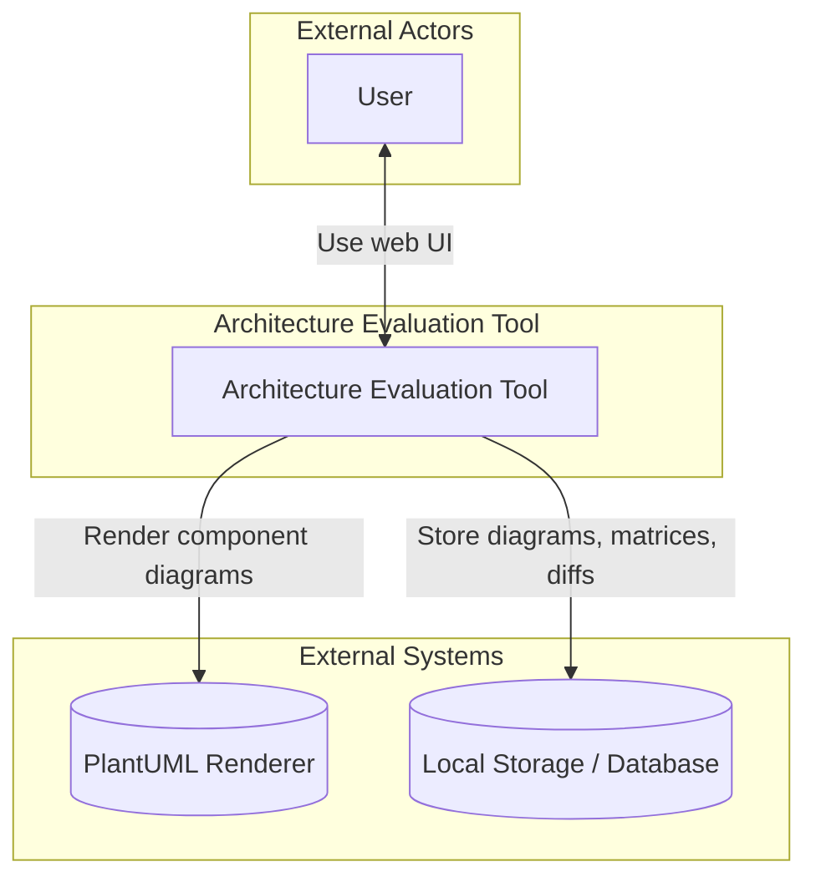
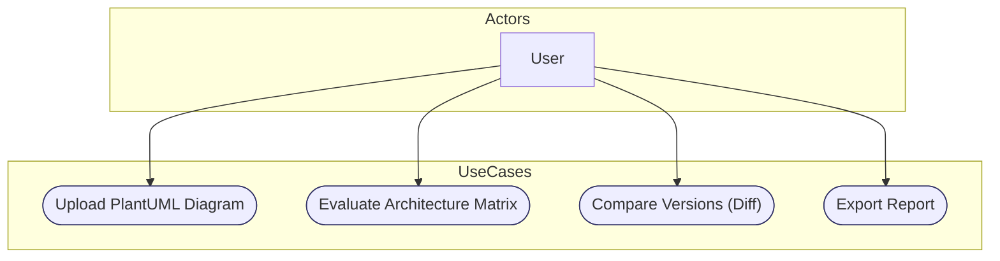
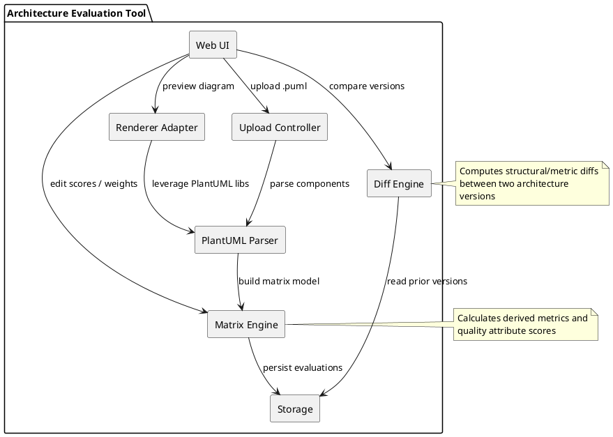
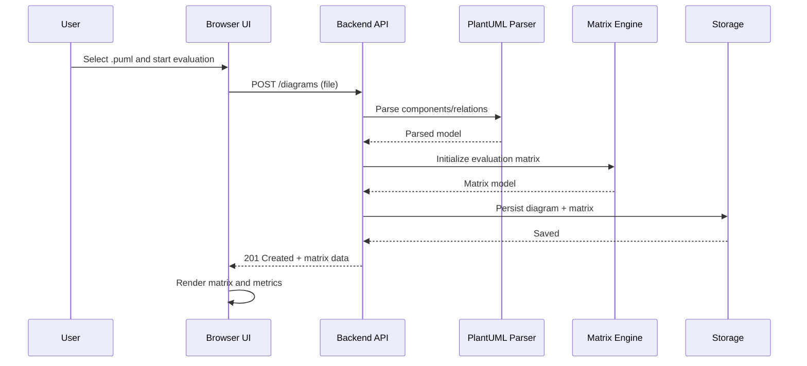
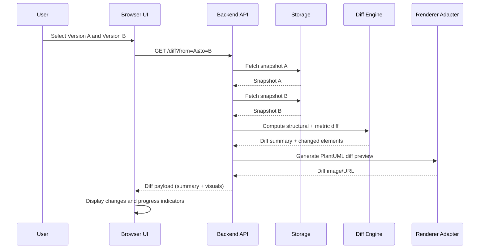
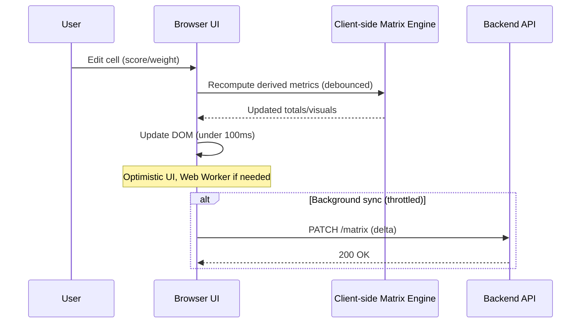

# Architecture Document

## Table of Contents
1. [Interactive prototype](#interactive-prototype)
2. [Context diagram (example)](#context-diagram-example)
   - [External actors](#external-actors)
3. [Use case diagram (example)](#use-case-diagram-example)
   - [Actors](#actors)
4. [Component diagram (example, code)](#component-diagram-example-code)
   - [Component responsibilities](#component-responsibilities)
5. [Sequence diagrams](#sequence-diagrams)
   - [User story: Upload PlantUML and evaluate](#user-story-upload-plantuml-and-evaluate)
   - [User story: Compare versions (Diff)](#user-story-compare-versions-diff)
   - [Quality requirement: Responsive Matrix Interaction (QAS201)](#quality-requirement-responsive-matrix-interaction-qas201)

## Interactive prototype

Link to the interactive prototype in Figma: [Figma link](https://www.figma.com/design/i01zuUDM9WZHPfULnAmpyI/Scheme?node-id=0-1&p=f)

## Context diagram (example)

Source: `docs/architecture/assets/context.mmd`

### External actors

- **User**: evaluates architectures against quality attributes, prepares reports.

## Use case diagram (example)

Source: `docs/architecture/assets/use-cases.mmd`

### Actors

- **User**: uploads diagrams, evaluates, and prepares evaluation reports.

## Component diagram (example, code)

Source: `docs/architecture/assets/components.puml`

### Component responsibilities

- **Web UI**: matrix visualization, editing scores/weights, diff view.
- **Upload Controller**: intake diagrams, validation, metadata extraction.
- **PlantUML Parser**: parse components/relations from PlantUML.
- **Matrix Engine**: build and compute matrix metrics and quality attribute scores.
- **Diff Engine**: compare two versions to produce structural and metric diffs.
- **Renderer Adapter**: integrate PlantUML rendering for previews.
- **Storage**: persist diagrams, matrices, and evaluation results.

## Sequence diagrams

### User story: Upload PlantUML and evaluate

Source: `docs/architecture/assets/seq-user-story.mmd`

### User story: Compare versions (Diff)

Source: `docs/architecture/assets/seq-diff.mmd`

### Quality requirement: Responsive Matrix Interaction (QAS201)

Derived from `docs/requirements/quality-requirements.md#performance` (QAS201: input-to-visual-update under 100ms).

Source: `docs/architecture/assets/seq-qas.mmd`

---

Notes:
- Diagram source code is stored under `docs/architecture/assets/`. Generate images into the same folder or subfolders as needed.
- Update the Figma link when the interactive prototype is available.

Progress tracking:
- Store versioned snapshots of diagrams, matrices, and computed metrics in `Storage` with timestamps.
- `Diff Engine` computes deltas between snapshots to visualize structural changes and quality score trends.
- UI aggregates diffs over time to show progress across iterations/sprints.

