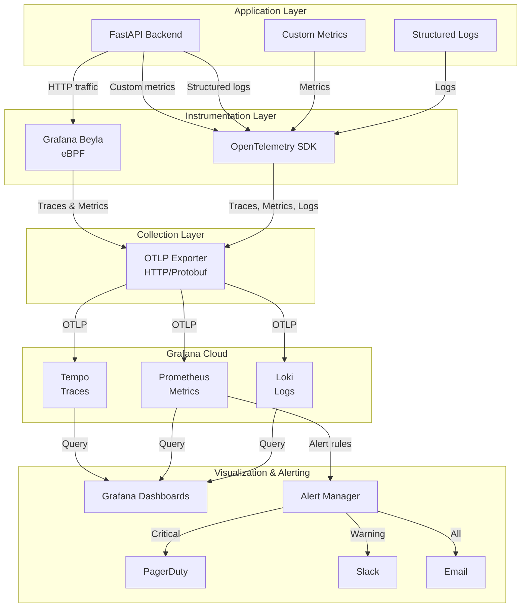
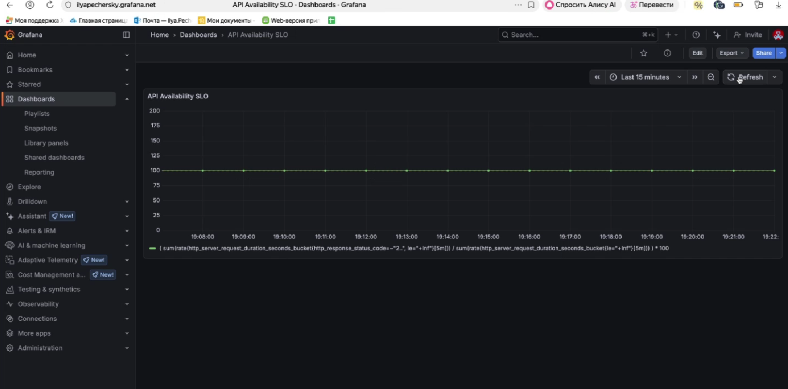
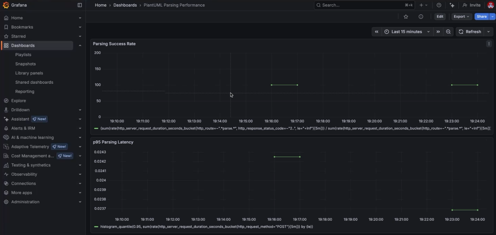
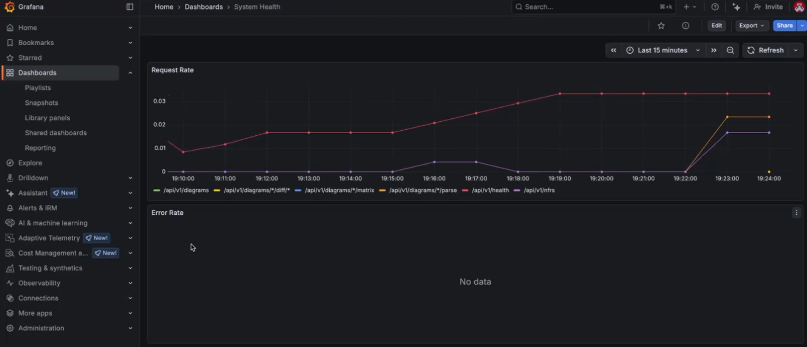

# Observability Plan: Monitoring, Diagnostics, and Alerting

**Perspective:** Builders and maintainers

**Focus:** Reliability, performance, system health

## Table of Contents

1. [Technical Risks Brainstorming](#technical-risks-brainstorming)
2. [Service Level Objectives (SLOs)](#service-level-objectives-slos)
3. [Instrumentation Plan](#instrumentation-plan)
4. [Alerting Plan](#alerting-plan)
5. [Response Plan](#response-plan)
6. [Data Collection Pipeline](#data-collection-pipeline)

## Technical Risks Brainstorming

### 1. API Availability Degradation

**Risk:** Backend API becomes unavailable or unresponsive, blocking all user
functionality.

**Root Causes:** Service crashes, database connection failures, container
failures, resource exhaustion.

**Severity:** **CRITICAL**

### 2. PlantUML Parsing Performance Degradation

**Risk:** Parsing takes longer than acceptable thresholds, violating QAS202
requirement (3 seconds for 95% of files).

**Root Causes:** Large files, complex nested structures, inefficient parsing,
database write delays.

**Severity:** **CRITICAL**

### 3. Database Performance Issues

**Risk:** PostgreSQL queries become slow, causing delays in data operations.

**Root Causes:** Missing indexes, connection pool exhaustion, database locks.

**Severity:** **HIGH**

### 4. High Error Rate in Parsing Operations

**Risk:** PlantUML parsing fails frequently, preventing users from uploading
valid diagrams.

**Root Causes:** Unsupported syntax patterns, parser bugs, edge cases.

**Severity:** **HIGH**

### 5. Resource Exhaustion

**Risk:** System runs out of memory, CPU, or disk space, causing service
degradation or crashes.

**Root Causes:** Memory leaks, large file uploads, database growth, request
spikes.

**Severity:** **HIGH**

## Service Level Objectives (SLOs)

### SLO 1: API Availability

**Risk:** API Availability Degradation

**SLO Statement:**

> To monitor API availability, we will track the **HTTP request success rate**.
> It must remain **above 99.5%** for **99% of requests over a 30-day rolling
> window**.

**Metric Calculation:**

- **Success Rate** = (Successful HTTP requests) / (Total HTTP requests) ×
  100%
- **Successful requests:** HTTP status codes 200-299
- **Failed requests:** HTTP status codes 500-599, timeouts, connection errors
- **Excluded:** Client errors (4xx) are not counted as failures

**SLO Violation Threshold:**

- **Warning:** Success rate drops below 99.7%
- **Critical:** Success rate drops below 99.5% (SLO violation)

### SLO 2: PlantUML Parsing Performance

**Risk:** PlantUML Parsing Performance Degradation

**SLO Statement:**

> To monitor PlantUML parsing performance, we will track the **p95 parsing
> latency**. It must remain **below 3 seconds** for **95% of parsing
> operations over a 7-day rolling window**.

**Metric Calculation:**

- **Parsing Latency:** Time from parsing request start to completion
- **Measured at:** `/api/v1/diagrams` POST endpoint (diagram upload)
- **p95 Latency:** 95th percentile of all parsing latencies in the window

**SLO Violation Threshold:**

- **Warning:** p95 latency exceeds 2.5 seconds
- **Critical:** p95 latency exceeds 3 seconds (SLO violation)

## Instrumentation Plan

### SLO 1: API Availability Metrics

#### Primary Metric: HTTP Request Success Rate

**How to Calculate:**

1. **Collect HTTP Request Metrics:**

   - **Source:** Grafana Beyla automatically captures HTTP metrics via eBPF
   - **Metrics:**
     - `http_server_request_count` - Total request count by status code
     - Labels: `http_status_code`, `http_method`, `http_route`

2. **Calculate Success Rate:**

   ```promql
   success_rate = (
     sum(rate(http_server_request_count{http_status_code=~"2.."}[5m])) /
     (
       sum(rate(http_server_request_count{http_status_code=~"2.."}[5m])) +
       sum(rate(http_server_request_count{http_status_code=~"5.."}[5m]))
     )
   ) * 100
   ```

3. **Rolling Window:**

   ```promql
   success_rate_30d = avg_over_time(success_rate[30d])
   ```

#### Supporting Metrics for Context

When SLO is violated, we need:

- **Error Rate by Endpoint:** Identify which endpoints are failing
- **Request Latency Distribution:** p50, p95, p99 latencies
- **Database Connection Pool Metrics:** Active/idle connections, query
  duration
- **Container Resource Metrics:** Memory, CPU usage, restart count
- **Traces:** Full request traces with spans for root cause analysis
- **Logs:** Error logs with stack traces, database connection errors

### SLO 2: PlantUML Parsing Performance Metrics

#### Primary Metric: p95 Parsing Latency

**How to Calculate:**

1. **Collect Parsing Duration:**

   - **Source:** Custom application metric (instrumented in code)
   - **Implementation:** Add histogram metric in `DiagramService`:

     ```python
     from opentelemetry import metrics
     meter = metrics.get_meter(__name__)
     parsing_duration = meter.create_histogram(
         "plantuml_parsing_duration_seconds",
         description="Time taken to parse PlantUML files",
         unit="s"
     )
     ```

2. **Calculate p95 Latency:**

   ```promql
   parsing_p95_7d = histogram_quantile(
     0.95,
     sum(rate(plantuml_parsing_duration_seconds_bucket[7d])) by (le)
   )
   ```

#### Supporting Metrics for Context

When SLO is violated, we need:

- **Parsing Latency by File Size:** Identify if large files cause slowness
- **Parsing Error Rate:** Track parsing failures
- **Component Count Distribution:** Check if high component count affects
  performance
- **Database Write Duration:** Check if database writes are blocking parsing
- **Traces:** Parsing operation spans with duration breakdown
- **Logs:** File size, component count, parsing errors

### Technical Implementation

**Data Collection Pipeline:**

```text
FastAPI App → Grafana Beyla (eBPF) → OTLP → Grafana Cloud
FastAPI App → OpenTelemetry SDK → OTLP → Grafana Cloud
```

**Storage in Grafana Cloud:**

- **Tempo:** Distributed traces
- **Prometheus:** Metrics (15-month retention)
- **Loki:** Structured logs (30-day retention)

## Alerting Plan

### Alert Thresholds

#### Alert 1: API Availability Warning

**Condition:** HTTP request success rate < 99.7%

**Severity:** **WARNING**

**Duration:** 5 minutes

**Notification:** Email to on-call engineer

#### Alert 2: API Availability Critical

**Condition:** HTTP request success rate < 99.5% (SLO violation)

**Severity:** **CRITICAL**

**Duration:** 2 minutes

**Notification:** PagerDuty/Slack + Email to on-call engineer

#### Alert 3: PlantUML Parsing Performance Warning

**Condition:** p95 parsing latency > 2.5 seconds

**Severity:** **WARNING**

**Duration:** 10 minutes

**Notification:** Email to on-call engineer

#### Alert 4: PlantUML Parsing Performance Critical

**Condition:** p95 parsing latency > 3 seconds (SLO violation)

**Severity:** **CRITICAL**

**Duration:** 5 minutes

**Notification:** PagerDuty/Slack + Email to on-call engineer

### Alert Delivery

**Channels:**

- **Email:** On-call engineer, team lead
- **Slack:** `#alerts-architecture-tool` channel
- **PagerDuty:** Critical alerts only (with escalation)

**Alert Routing:**

- **Warning alerts:** Email + Slack
- **Critical alerts:** Email + Slack + PagerDuty (with escalation)

## Response Plan

### Scenario: API Availability Critical Alert

**Alert Triggered:** HTTP request success rate drops below 99.5%

#### Who Gets Notified?

1. **Primary:** On-call engineer (via PagerDuty)
2. **Secondary:** Team lead (via email)
3. **Tertiary:** Manager (if escalation after 15 minutes)

#### First Steps

1. **Acknowledge Alert (within 2 minutes):**

   - Acknowledge PagerDuty incident
   - Post in Slack: "Investigating API availability issue"

2. **Check Service Status (within 5 minutes):**

   - Check if backend is running: `docker-compose ps backend`
   - Check backend logs: `docker-compose logs backend --tail 100`
   - Check health endpoint: `curl http://localhost:8000/api/v1/health`
   - Check database connection: `docker-compose exec postgres pg_isready`

3. **Review Metrics Dashboard (within 5 minutes):**

   - Open Grafana dashboard: "API Availability SLO"
   - Check: success rate, error rate by endpoint, request latency, database
     connection pool, container resource usage

4. **Review Traces and Logs (within 10 minutes):**

   - Open Grafana Tempo: Query failed requests
   - Open Grafana Loki: Query error logs
   - Identify: failing endpoints, error types, common patterns

5. **Initial Triage (within 15 minutes):**

   - **If backend is down:** Restart backend, monitor logs
   - **If database issues:** Check PostgreSQL status, restart if needed
   - **If high error rate:** Identify failing endpoints, check recent
     deployments
   - **If resource exhaustion:** Check container memory/CPU, scale if needed

6. **Escalation (if not resolved in 15 minutes):**

   - Update PagerDuty with findings
   - Escalate to team lead
   - Post status update in Slack

### Scenario: PlantUML Parsing Performance Critical Alert

**Alert Triggered:** p95 parsing latency exceeds 3 seconds

#### Who Gets Notified?

1. **Primary:** On-call engineer (via PagerDuty)
2. **Secondary:** Team lead (via email)

#### First Steps

1. **Acknowledge Alert (within 2 minutes):**

   - Acknowledge PagerDuty incident
   - Post in Slack: "Investigating parsing performance issue"

2. **Check Parsing Metrics (within 5 minutes):**

   - Open Grafana dashboard: "PlantUML Parsing Performance"
   - Check: current p95 latency, latency by file size, parsing error rate,
     component count distribution

3. **Review Recent Parsing Operations (within 10 minutes):**

   - Open Grafana Tempo: Query slow parsing traces (duration > 3s)
   - Identify: large file sizes, high component counts, database write delays

4. **Review Parsing Logs (within 10 minutes):**

   - Open Grafana Loki: Query parsing logs
   - Look for: file sizes, component counts, regex performance, database write
     durations

5. **Initial Triage (within 15 minutes):**

   - **If large files:** Check file size distribution, consider size limits
   - **If database delays:** Check query performance, connection pool
   - **If regex bottleneck:** Review regex patterns, optimize if needed
   - **If high component count:** Consider batching database writes

6. **Escalation (if not resolved in 15 minutes):**

   - Update PagerDuty with findings
   - Escalate to team lead
   - Post status update in Slack

## Data Collection Pipeline

### Architecture Diagram



### Data Flow

1. **Application Layer:** FastAPI backend, custom metrics, structured logs
2. **Instrumentation Layer:** Grafana Beyla (eBPF), OpenTelemetry SDK
3. **Collection Layer:** OTLP exporter (HTTP/Protobuf) to Grafana Cloud
4. **Storage Layer:** Tempo (traces), Prometheus (metrics), Loki (logs)
5. **Visualization & Alerting:** Grafana dashboards, Alert Manager,
   PagerDuty/Slack/Email notifications

---

## Visualization and Dashboards

### Monitoring and Diagnostics Dashboards

All monitoring dashboards are available in Grafana Cloud. Access them at:
[Grafana Cloud Dashboards](https://grafana.com/orgs/<your-org>/dashboards)

#### API Availability SLO Dashboard

**Purpose:** Monitor API availability SLO (99.5% success rate)

**Link:** [API Availability SLO Dashboard](https://grafana.com/orgs/<your-org>/dashboards/api-availability-slo)

**Key Panels:**

1. **HTTP Request Success Rate**
   - Metric: `(sum(rate(http_server_request_count{http_status_code=~"2.."}[5m])) /
     (sum(rate(http_server_request_count{http_status_code=~"2.."}[5m])) +
     sum(rate(http_server_request_count{http_status_code=~"5.."}[5m])))) * 100`
   - Target: ≥ 99.5%
   - Visualization: Time series with SLO threshold line

2. **Error Rate by Endpoint**
   - Metric: `sum(rate(http_server_request_count{http_status_code=~"5.."}[5m])) by (http_route)`
   - Visualization: Bar chart

3. **Request Latency Distribution**
   - Metrics: p50, p95, p99 latencies
   - Visualization: Time series with multiple percentiles

4. **30-Day Rolling Success Rate**
   - Metric: `avg_over_time(success_rate[30d])`
   - Visualization: Single stat with trend

**Screenshot:**



*Note: Replace with actual screenshot after dashboard creation*

#### PlantUML Parsing Performance Dashboard

**Purpose:** Monitor parsing performance SLO (p95 < 3 seconds)

**Link:** [Parsing Performance Dashboard](https://grafana.com/orgs/<your-org>/dashboards/parsing-performance)

**Key Panels:**

1. **p95 Parsing Latency**
   - Metric: `histogram_quantile(0.95, sum(rate(plantuml_parsing_duration_seconds_bucket[5m])) by (le))`
   - Target: < 3 seconds
   - Visualization: Time series with SLO threshold line

2. **Parsing Latency Distribution**
   - Metrics: p50, p95, p99 percentiles
   - Visualization: Time series with multiple percentiles

3. **Parsing Latency by File Size**
   - Metric: `histogram_quantile(0.95, sum(rate(plantuml_parsing_duration_seconds_bucket[5m])) by (le, file_size_bucket))`
   - Visualization: Heatmap

4. **Parsing Error Rate**
   - Metric: `sum(rate(plantuml_parsing_duration_seconds_count{status="error"}[5m])) / sum(rate(plantuml_parsing_duration_seconds_count[5m]))`
   - Visualization: Time series

5. **7-Day Rolling p95 Latency**
   - Metric: `histogram_quantile(0.95, sum(rate(plantuml_parsing_duration_seconds_bucket[7d])) by (le))`
   - Visualization: Single stat with trend

**Screenshot:**



*Note: Replace with actual screenshot after dashboard creation*

#### System Health Dashboard

**Purpose:** Monitor overall system health and resource usage

**Link:** [System Health Dashboard](https://grafana.com/orgs/<your-org>/dashboards/system-health)

**Key Panels:**

1. **Container Resource Usage**
   - Metrics: CPU usage, memory usage, restart count
   - Visualization: Time series graphs

2. **Database Connection Pool**
   - Metrics: Active connections, idle connections, pool size
   - Visualization: Time series

3. **Request Rate**
   - Metric: `rate(http_server_request_count[5m])`
   - Visualization: Time series

4. **Error Rate**
   - Metric: `rate(http_server_request_count{http_status_code=~"5.."}[5m])`
   - Visualization: Time series

**Screenshot:**



*Note: Replace with actual screenshot after dashboard creation*

### Traces and Logs

#### Distributed Traces (Tempo)

**Purpose:** Investigate request flows and identify bottlenecks

**Link:** [Tempo Explore](https://grafana.com/orgs/<your-org>/explore?orgId=1&left=%5B%22now-1h%22,%22now%22,%22Tempo%22%5D)

**Query Examples:**

- `{service.name="open_telemetry"}` - All traces
- `{service.name="open_telemetry" status="error"}` - Error traces
- `{service.name="open_telemetry" operation="diagram.parse"}` - Parsing operations

**Screenshot:**


*Note: Replace with actual screenshot after dashboard creation*

#### Structured Logs (Loki)

**Purpose:** Search and analyze application logs

**Link:** [Loki Explore](https://grafana.com/orgs/<your-org>/explore?orgId=1&left=%5B%22now-1h%22,%22now%22,%22Loki%22%5D)

**Query Examples:**

- `{service="backend"} |= "ERROR"` - Error logs
- `{service="backend"} |= "parsing"` - Parsing-related logs
- `{service="backend"} | json` - Structured JSON logs

**Screenshot:**


*Note: Replace with actual screenshot after dashboard creation*

### Metrics Available

The following metrics are collected and available in Grafana Cloud:

**HTTP Metrics (via Beyla):**

- `http_server_request_count` - Request count by status code
- `http_server_request_duration_seconds` - Request duration histogram
- `http_server_request_size` - Request size histogram
- `http_server_response_size` - Response size histogram

**Custom Metrics (via OpenTelemetry SDK):**

- `plantuml_parsing_duration_seconds` - Parsing duration histogram (SLO 2)
- `diagram_uploaded_total` - Diagram upload counter
- `parsing_succeeded_total` - Successful parsing counter
- `parsing_failed_total` - Failed parsing counter

**Infrastructure Metrics:**

- `container_memory_usage_bytes` - Container memory usage
- `container_cpu_usage_seconds_total` - Container CPU usage
- `container_restart_count` - Container restart count

### Creating Dashboards

To create these dashboards in Grafana Cloud:

1. Navigate to **Dashboards** → **New Dashboard**
2. Add panels using Prometheus queries for the metrics above
3. Use Grafana's query builder or PromQL:
   - `rate(http_server_request_count[5m])` - Request rate
   - `histogram_quantile(0.95, rate(plantuml_parsing_duration_seconds_bucket[5m]))` - p95 parsing latency
4. Configure alerts based on SLO thresholds defined in this document
5. Set up alert rules in **Alerting** → **Alert Rules**
