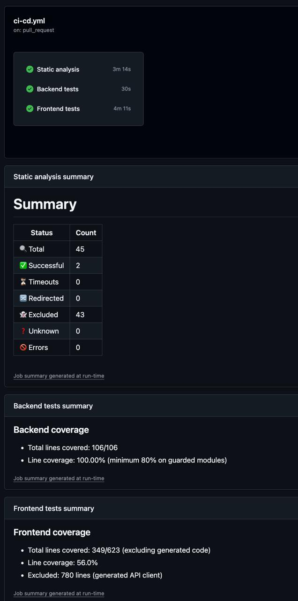

# Interview Script

## Interview Information

- **Estimated Duration**: 20 minutes
- **Purpose**: Approval of testing strategy and show progress
- **Participants**: Denis Nikolskiy, Ilya Pechersky, Roukaya Mohammed,
  Timur Harin

## Script Structure

### Discuss This Sprint's Accomplishments

- Backend Unit Testing: Established unit testing framework with 80% minimum coverage threshold
- Frontend: Added Flutter tests
- Documentation: markdown linters to CI pipeline
- Continuous Integration: GitHub Actions workflow running build, lint, and test checks automatically
- Pull Request Requirements: All changes must pass automated checks before merging
- Discuss review of TDD on tasks in this sprint

### Show Demo

- Show demonestration
- Get feedback and comments
- Discuss next sprint goal
